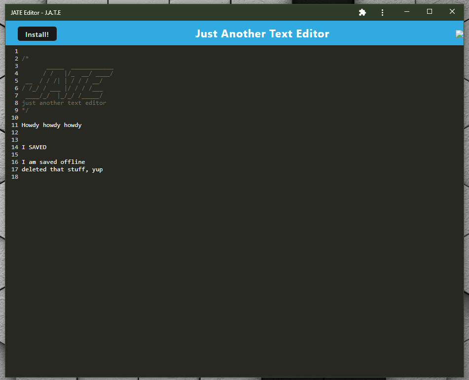

# JATE PWA Text Editor
  [](https://opensource.org/licenses/MIT)

## TABLE OF CONTENTS:

* [Description](#description)

* [Installation guide](#installation) 

* [Usage Info](#usage-info) 

* [Contribution Guidelines](#contribution-guidelines) 

* [Testing Instructions](#testing-instructions) 

* [Questions](#questions)

* [Credit](#credit)

* [License](#license)


## DESCRIPTION:

This is a Progressive Web App able to be used in browser and downloaded and installed to be used offline.  

  

## INSTALLATION:

Open the app in browser. Click the ```Install!``` button to download to desktop.

## USAGE INFO:

Visit the app [here](https://lawhorn-jate-editor.herokuapp.com/)

Type into the text editor and your progress will automatically be backed up to the database.

## CONTRIBUTION GUIDELINES:

Sorry, this project is privately maintained.

## TESTING INSTRUCTIONS:

Thank you, but no testing is needed at this time.

## QUESTIONS:

If you have any questions,  
<a target="_blank" rel="noopener noreferrer" href="https://github.com/Lawhornmatt">visit my GitHub</a> and send me a message  
or email me here: fake@notreal.com  

## CREDIT:

This project was made in 2022 by Matt Lawhorn

## LICENSE:

This program is copyrighted under the MIT open source license.

Copyright 2022 Matt Lawhorn

    Permission is hereby granted, free of charge, to any person obtaining a copy of this software and associated documentation files (the "Software"), to deal in the Software without restriction, including without limitation the rights to use, copy, modify, merge, publish, distribute, sublicense, and/or sell copies of the Software, and to permit persons to whom the Software is furnished to do so, subject to the following conditions:
    
    The above copyright notice and this permission notice shall be included in all copies or substantial portions of the Software.
    
    THE SOFTWARE IS PROVIDED "AS IS", WITHOUT WARRANTY OF ANY KIND, EXPRESS OR IMPLIED, INCLUDING BUT NOT LIMITED TO THE WARRANTIES OF MERCHANTABILITY, FITNESS FOR A PARTICULAR PURPOSE AND NONINFRINGEMENT. IN NO EVENT SHALL THE AUTHORS OR COPYRIGHT HOLDERS BE LIABLE FOR ANY CLAIM, DAMAGES OR OTHER LIABILITY, WHETHER IN AN ACTION OF CONTRACT, TORT OR OTHERWISE, ARISING FROM, OUT OF OR IN CONNECTION WITH THE SOFTWARE OR THE USE OR OTHER DEALINGS IN THE SOFTWARE.

[Further license information can be found here.](https://opensource.org/licenses/MIT)

